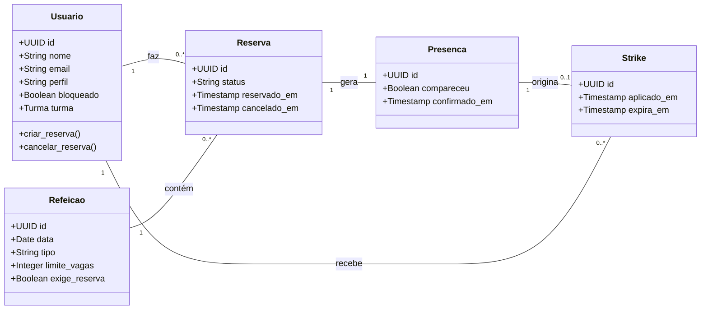

# Diagrama de Classes

```mermaid
classDiagram
    direction LR

    class Usuario {
        +UUID id
        +String nome
        +String email
        +String perfil
        +Boolean bloqueado
        +Turma turma
        +criar_reserva()
        +cancelar_reserva()
    }

    class Refeicao {
        +UUID id
        +Date data
        +String tipo
        +Integer limite_vagas
        +Boolean exige_reserva
    }

    class Reserva {
        +UUID id
        +String status
        +Timestamp reservado_em
        +Timestamp cancelado_em
    }

    class Presenca {
        +UUID id
        +Boolean compareceu
        +Timestamp confirmado_em
    }

    class Strike {
        +UUID id
        +Timestamp aplicado_em
        +Timestamp expira_em
    }

    Usuario "1" -- "0..*" Reserva : faz
    Refeicao "1" -- "0..*" Reserva : contém
    Reserva "1" -- "1" Presenca : gera
    Presenca "1" -- "0..1" Strike : origina
    Usuario "1" -- "0..*" Strike : recebe
```