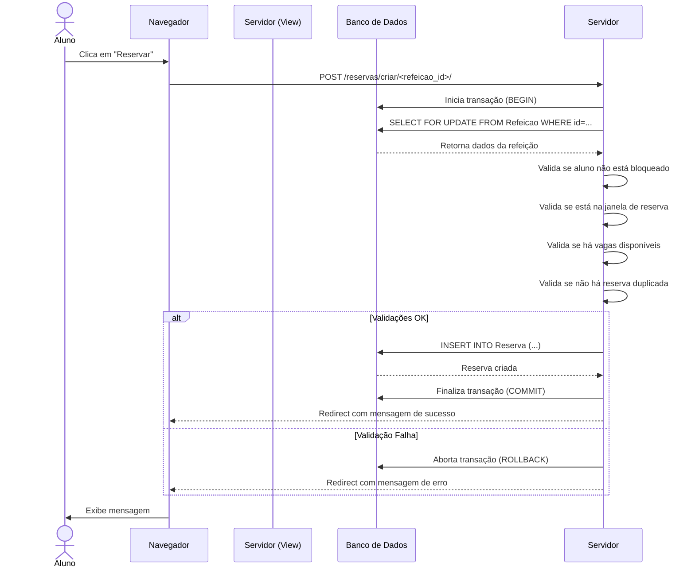

# Diagrama de Sequência - Criar Reserva

```mermaid
sequenceDiagram
    actor Aluno
    participant Navegador
    participant Servidor (View)
    participant Banco de Dados

    Aluno->>Navegador: Clica em "Reservar"
    Navegador->>Servidor: POST /reservas/criar/<refeicao_id>/
    
    Servidor->>Banco de Dados: Inicia transação (BEGIN)
    Servidor->>Banco de Dados: SELECT FOR UPDATE FROM Refeicao WHERE id=...
    Banco de Dados-->>Servidor: Retorna dados da refeição
    
    Servidor->>Servidor: Valida se aluno não está bloqueado
    Servidor->>Servidor: Valida se está na janela de reserva
    Servidor->>Servidor: Valida se há vagas disponíveis
    Servidor->>Servidor: Valida se não há reserva duplicada
    
    alt Validações OK
        Servidor->>Banco de Dados: INSERT INTO Reserva (...)
        Banco de Dados-->>Servidor: Reserva criada
        Servidor->>Banco de Dados: Finaliza transação (COMMIT)
        Servidor-->>Navegador: Redirect com mensagem de sucesso
    else Validação Falha
        Servidor->>Banco de Dados: Aborta transação (ROLLBACK)
        Servidor-->>Navegador: Redirect com mensagem de erro
    end
    Navegador->>Aluno: Exibe mensagem
```