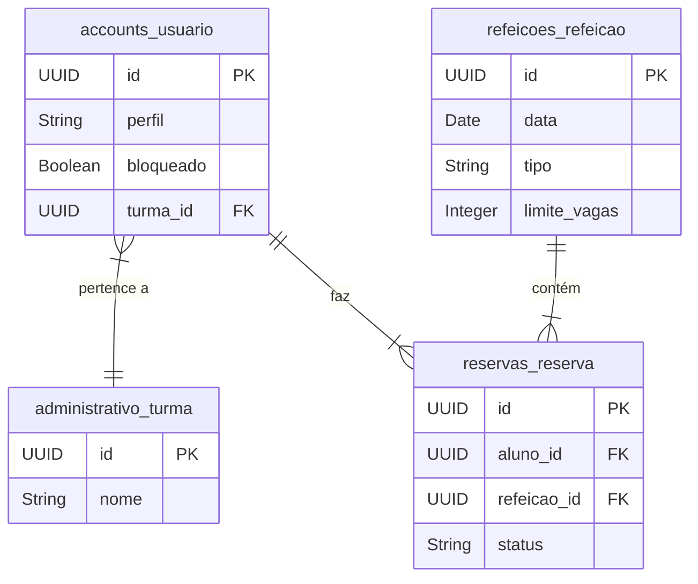

# Modelo Lógico do Banco de Dados

```mermaid
erDiagram
    accounts_usuario {
        UUID id PK
        String perfil
        Boolean bloqueado
        UUID turma_id FK
    }
    administrativo_turma {
        UUID id PK
        String nome
    }
    reservas_reserva {
        UUID id PK
        UUID aluno_id FK
        UUID refeicao_id FK
        String status
    }
    refeicoes_refeicao {
        UUID id PK
        Date data
        String tipo
        Integer limite_vagas
    }

    accounts_usuario }|--|| administrativo_turma : "pertence a"
    accounts_usuario ||--|{ reservas_reserva : "faz"
    refeicoes_refeicao ||--|{ reservas_reserva : "contém"

```